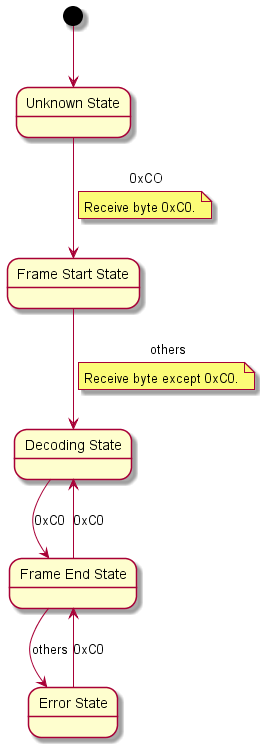

解码器状态机图如下所示：

对于 SLIP 解码器状态机，Bluetooth Core Spec 5.2 里做了如下说明：

> When decoding a SLIP stream, a device will first be in an unknown state, not knowing if it is at the start of a packet or in the middle of a packet. The device must therefore discard all octets until it finds a 0xC0. If the 0xC0 is followed immediately by a second 0xC0, then the device will discard the first 0xC0 as it was presumably the end of the last packet, and the second 0xC0 was the start of the next packet. The device will then be in the decoding packet state. It can then decode the octets directly changing any SLIP escape sequences back into their unencoded form. When the device decodes the 0xC0 at the end of the packet, it will calculate the length of the SLIP packet, and pass the packet data into the packet decoder. The device will then seek the next packet. If the device does not receive an 0xC0 for the start of the next packet, then all octets up to and including the next 0xC0 will be discarded.